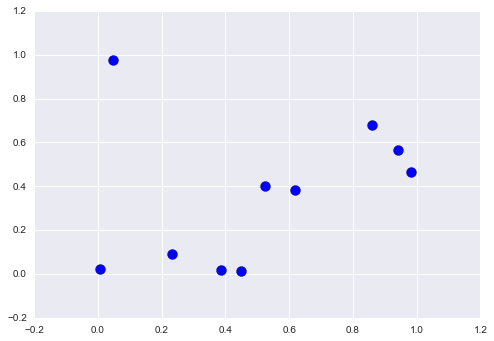

## 9.10 数组排序

> 原文：[Sorting Arrays](https://nbviewer.jupyter.org/github/donnemartin/data-science-ipython-notebooks/blob/master/numpy/02.08-Sorting.ipynb)
> 
> 译者：[飞龙](https://github.com/wizardforcel)
> 
> 协议：[CC BY-NC-SA 4.0](http://creativecommons.org/licenses/by-nc-sa/4.0/)
> 
> 本节是[《Python 数据科学手册》](https://github.com/jakevdp/PythonDataScienceHandbook)（Python Data Science Handbook）的摘录。

到目前为止，我们主要关注使用 NumPy 访问和操作数组数据的工具。本节介绍与 NumPy 数组中的值的排序相关的算法。

这些算法是计算机科学入门课程中最受欢迎的主题：如果你曾经上过这些课，你可能对插入排序，选择排序，归并排序，快速排序，冒泡排序，甚至更多的东西，有一些回忆（或者是噩梦，取决于你的性格）。

所有这些都是完成类似任务的方法：对列表或数组中的值排序。例如，简单的选择排序重复查找列表中的最小值，并进行交换直到列表是有序的。我们可以在几行 Python 中编写代码：

```py
import numpy as np

def selection_sort(x):
    for i in range(len(x)):
        swap = i + np.argmin(x[i:])
        (x[i], x[swap]) = (x[swap], x[i])
    return x

x = np.array([2, 1, 4, 3, 5])
selection_sort(x)

# array([1, 2, 3, 4, 5])
```

正如任何计算机科学专业的一年级学生都会告诉你的那样，出于它的简单性，选择排序很有用，但是对于较大的数组来说太慢了。对于`N`个元素的列表，它需要`N`个循环，每个循环都执行大约`N`个比较，来查找要交换的值。

就通常用于表示这些算法的“大 O”记号而言（参见“大 O 记号”），选择排序平均是`O(n^2)`的：如果你将列表中的项目数加倍，执行时间将增加大约四倍。

尽管选择排序比我最喜欢的排序算法，`bogosort`要好得多：

```py
def bogosort(x):
    while np.any(x[:-1] > x[1:]):
        np.random.shuffle(x)
    return x

x = np.array([2, 1, 4, 3, 5])
bogosort(x)

# array([1, 2, 3, 4, 5])
```

这种愚蠢的排序方法纯粹依赖于机会：它反复应用数组的随机打乱，直到结果是有序的。平均规模为`O(n * n!)`，这显然应该永远不会用于任何实际计算。

幸运的是，Python包含内置的排序算法，这些算法比刚刚展示的任何简单算法都高效得多。 我们将首先查看 Python 内置函数，然后查看 NumPy 中包含的，并针对 NumPy 数组优化的例程。

### NumPy 中的快速排序：``np.sort``和``np.argsort``

尽管 Python 内置了``sort``和``sorted``函数来处理列表，但我们不会在这里讨论它们，因为 NumPy 的``np.sort``函数效率更高，对于我们的目的更有用。

默认情况下，``np.sort``使用`O(nlogn)`的快速排序算法，但归并排序和堆排序也可用。 对于大多数应用程序，默认的快速排序绰绰有余。

```py
x = np.array([2, 1, 4, 3, 5])
np.sort(x)

# array([1, 2, 3, 4, 5])
```

如果你希望对数组原地排序，则可以使用数组的``sort``方法：

```py
x.sort()
print(x)

# [1 2 3 4 5]
```

相关函数是``argsort``，它返回已排序元素的下标：

```py
x = np.array([2, 1, 4, 3, 5])
i = np.argsort(x)
print(i)

# [1 0 3 2 4]
```

此结果的第一个元素给出最小元素的索引，第二个值给出第二小元素的索引，依此类推。然后，如果需要，可以使用这些索引（通过花式索引）构造有序数组：

```py
x[i]

# array([1, 2, 3, 4, 5])
```

#### 沿行或列的排序

NumPy 排序算法的一个有用特性是，能够使用``axis``参数来排序多维数组的特定行或列。例如：

```py
rand = np.random.RandomState(42)
X = rand.randint(0, 10, (4, 6))
print(X)

'''
[[6 3 7 4 6 9]
 [2 6 7 4 3 7]
 [7 2 5 4 1 7]
 [5 1 4 0 9 5]]
'''

# 排序 X 的每一列
np.sort(X, axis=0)

'''
array([[2, 1, 4, 0, 1, 5],
       [5, 2, 5, 4, 3, 7],
       [6, 3, 7, 4, 6, 7],
       [7, 6, 7, 4, 9, 9]])
'''

# 排序 X 的每一行
np.sort(X, axis=1)

'''
array([[3, 4, 6, 6, 7, 9],
       [2, 3, 4, 6, 7, 7],
       [1, 2, 4, 5, 7, 7],
       [0, 1, 4, 5, 5, 9]])
'''
```

请记住，这会将每个行或列视为一个独立的数组，并且行或列值之间的任何关系都将丢失！

### 部分排序：分区

有时我们对排序整个数组不感兴趣，但只想在数组中找到`k`个最小值。 NumPy 在``np.partition``函数中提供了它。``np.partition``接受一个数组和一个数字`K`；结果是一个新数组，最小的`K`个值在分区左边，任意顺序的剩下的值在右边：

```py
x = np.array([7, 2, 3, 1, 6, 5, 4])
np.partition(x, 3)

# array([2, 1, 3, 4, 6, 5, 7])
```

请注意，结果数组中的前三个值是数组中的三个最小值，其余数组位置包含其余值。在这两个分区中，元素具有任意顺序。

与排序类似，我们可以沿多维数组的任意轴进行分区：

```py
np.partition(X, 2, axis=1)

'''
array([[3, 4, 6, 7, 6, 9],
       [2, 3, 4, 7, 6, 7],
       [1, 2, 4, 5, 7, 7],
       [0, 1, 4, 5, 9, 5]])
'''
```

结果是一个数组，其中每行中的前两个槽包含该行中的最小值，其余值填充剩余的槽。

最后，就像计算有序索引的``np.argsort``一样，``np.argpartition``来计算分区的索引。我们将在下一节中看到它。

### 示例：K 最近邻

让我们快速了解如何沿着多个轴使用这个``argsort``函数，来查找集合中每个点的最近邻居。我们首先在二维平面上创建一组 10 个随机点。使用标准惯例，我们将在`10x2`数组中存放它们：

```py
X = rand.rand(10, 2)
```

为了了解这些点的外观，让我们快速绘制散点图：

```py
%matplotlib inline
import matplotlib.pyplot as plt
import seaborn; seaborn.set() # 绘图风格
plt.scatter(X[:, 0], X[:, 1], s=100);
```



现在我们将计算每对点之间的距离。回想一下，两点之间的平方距离是每个维度的平方差的总和；使用由 NumPy 提供的，高效广播（“数组计算：广播”）和聚合（“聚合：最小值，最大值和之间的一切”）的例程，我们可以在一行代码中计算平方距离矩阵：

```py
dist_sq = np.sum((X[:, np.newaxis, :] - X[np.newaxis, :, :]) ** 2, axis=-1)
```

这个操作有很多内容，如果你不熟悉 NumPy 的广播规则，可能会有点混乱。 当你遇到这样的代码时，将其分解为子步骤会很有用：

```py
# 对于每一对点
# 计算坐标的差
differences = X[:, np.newaxis, :] - X[np.newaxis, :, :]
differences.shape

# (10, 10, 2)

# 计算坐标的差
sq_differences = differences ** 2
sq_differences.shape

# (10, 10, 2)

# 对坐标差求和来获取距离平方
dist_sq = sq_differences.sum(-1)
dist_sq.shape

# (10, 10)
```

为了仔细检查我们正在做什么，我们应该看到这个矩阵的对角线（即每个点和它自身之间的距离）都是零：

```py
dist_sq.diagonal()

# array([ 0.,  0.,  0.,  0.,  0.,  0.,  0.,  0.,  0.,  0.])
```

就是这样！使用转换的成对的平方距离，我们现在可以使用``np.argsort``对每行排序。 最左边的列将给出最近邻居的索引：

```py
nearest = np.argsort(dist_sq, axis=1)
print(nearest)

'''
[[0 3 9 7 1 4 2 5 6 8]
 [1 4 7 9 3 6 8 5 0 2]
 [2 1 4 6 3 0 8 9 7 5]
 [3 9 7 0 1 4 5 8 6 2]
 [4 1 8 5 6 7 9 3 0 2]
 [5 8 6 4 1 7 9 3 2 0]
 [6 8 5 4 1 7 9 3 2 0]
 [7 9 3 1 4 0 5 8 6 2]
 [8 5 6 4 1 7 9 3 2 0]
 [9 7 3 0 1 4 5 8 6 2]]
'''
```

请注意，第一列按顺序给出数字 0 到 9：这是因为每个点的最近邻居就是它自己，这就是我们所期望的。

通过在这里使用完整的排序，在这种情况下，我们实际上完成的工作比我们需要的更多。 如果我们只是对最近的`k`个邻居感兴趣，我们所需要的就是对每一行进行分区，以便最小的`k + 1`个平方距离首先出现，更大的距离填充数组的剩余位置。 我们可以使用``np.argpartition``函数执行此操作：

```py
K = 2
nearest_partition = np.argpartition(dist_sq, K + 1, axis=1)
```

为了可视化这个邻居网络，让我们快速绘制点和线，它表示从每个点到其两个最近邻居的连接：

```py
plt.scatter(X[:, 0], X[:, 1], s=100)

# 绘制每个点到它的两个最近邻的直线
K = 2

for i in range(X.shape[0]):
    for j in nearest_partition[i, :K+1]:
        # 绘制 X[i] 到 X[j] 的直线
        # 使用一些 zip 魔法来实现
        plt.plot(*zip(X[j], X[i]), color='black')
```


图中的每个点都有到两个最近邻居的绘制的线。看一眼，有些点有两条以上的线可能看起来很奇怪：这是因为如果 A 是 B 的两个最近邻之一，这并不一定意味着 B 是 A 的两个最近邻点之一。

虽然这种方法的广播和逐行排序，可能看起来不像编写循环那么简单，但事实证明，这是在 Python 中对这些数据进行操作的一种非常有效的方法。

你可能会尝试通过手动循环数据，并单独对每组邻居进行排序，来执行相同类型的操作，但这几乎肯定会产生比我们使用的向量化版本更慢的算法。 这种方法的优点在于，它的编写方式与输入数据的大小无关：我们可以在任意数量的维度中轻松计算 100 或 1,000,000 个点的邻居，并且代码看起来相同。

最后，我会注意到，在进行非常大的最近邻搜索时，有基于树的算法和/或近似算法，可以变为`O(nlogn)`或更好，而不是`O(n^2)`的暴力算法。 其中一个例子是 KD-Tree，[在 Scikit-learn 中实现](http://scikit-learn.org/stable/modules/generated/sklearn.neighbors.KDTree.html)。

### 注：大 O 记号

大 O 记号是一种方法，描述算法所需操作数量随输入大小增长的变化。为了正确使用它，需要深入研究计算机科学理论的领域，并仔细区分它与相关的小 o 符号，大 $\theta$ 符号，大 $\Omega$ 符号，以及可能的许多变体。

虽然这些区别使算法规模，外部计算机科学理论考试和迂腐的博客评论者的评论更加精确，但你很少会在实践中看到这种区别。

在数据科学领域更常见的是使用不太严格的大 O 记号：作为算法规模的一般（如果不精确）描述。向理论家和学生道歉，这是我们将在本书中使用的解释。


在这种宽松的意义上，大 O 记号会告诉你，在增加数据量时算法将花费多少时间。如果你有一个`O(N)`（读取`N`阶）的算法，它在长度为`N = 1,000`的列表上运行需要 1 秒，那么对于长度`N = 5,000`，你应该预计大约需要 5 秒。如果你有一个`O(N^2)`（读取`N`方阶）的算法，对于`N = 1000`它需要 1 秒，那么对于`N = 5000`，你应该预计它需要大约 25 秒。

出于我们的目的，`N`通常表示数据集大小的某些方面（点数，维数等）。 当试图分析数十亿或数万亿的样本时，`O(N)`和`O(N^2)`之间的差异可能并不是微不足道！

请注意，大 O 记号本身不会告诉你计算的实际时钟时间，而只会告诉你在更改`N`时的规模。通常，例如，`O(N)`算法被认为具有比`O(N^2)`算法更好的规模，并且有充分的理由。 但是对于小型数据集，规模更好的算法可能不会更快。

例如，在给定问题中，`O(N^2)`算法可能需要 0.01 秒，而“更好的”`O(N)`算法可能需要 1 秒。然而，将`N`按比例放大 1000 倍，`O(N)`算法将胜出。

在比较算法的性能时，即使是这个松散版本的大 O 记号也非常有用，在讨论算法如何扩展时，我们将在整本书中使用这种记号。
