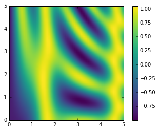

## 9.7 数组上的计算：广播

> 本节是[《Python 数据科学手册》](https://github.com/jakevdp/PythonDataScienceHandbook)（Python Data Science Handbook）的摘录。
> 
> 译者：[飞龙](https://github.com/wizardforcel)
> 
> 协议：[CC BY-NC-SA 4.0](http://creativecommons.org/licenses/by-nc-sa/4.0/)

我们在上一节中看到，NumPy 的通用函数如何用于向量化操作，从而消除缓慢的 Python 循环。向量化操作的另一种方法是使用 NumPy 的广播功能。广播只是一组规则，用于在不同大小的数组上应用二元`ufunc`（例如，加法，减法，乘法等）。

### 广播简介

回想一下，对于相同大小的数组，二元操作是逐元素执行的：

```py
import numpy as np

a = np.array([0, 1, 2])
b = np.array([5, 5, 5])
a + b

# array([5, 6, 7])
```

广播允许在不同大小的数组上执行这类二元操作 - 例如，我们可以轻松将数组和标量相加（将其视为零维数组）：

```py
a + 5

# array([5, 6, 7])
```

我们可以将此视为一个操作，将值`5`拉伸或复制为数组`[5,5,5]`，并将结果相加。

NumPy 广播的优势在于，这种值的重复实际上并没有发生，但是当我们考虑广播时，它是一种有用的心理模型。

我们可以类似地，将其扩展到更高维度的数组。 将两个二维数组相加时观察结果：

```py
M = np.ones((3, 3))
M

'''
array([[ 1.,  1.,  1.],
       [ 1.,  1.,  1.],
       [ 1.,  1.,  1.]])
'''

M + a

'''
array([[ 1.,  2.,  3.],
       [ 1.,  2.,  3.],
       [ 1.,  2.,  3.]])
'''
```

这里，一维数组`a`被拉伸，或者在第二维上广播，来匹配`M`的形状。

虽然这些示例相对容易理解，但更复杂的情况可能涉及两个数组的广播。请考虑以下示例：

```py
a = np.arange(3)
b = np.arange(3)[:, np.newaxis]

print(a)
print(b)

'''
[0 1 2]
[[0]
 [1]
 [2]]
'''

a + b

'''
array([[0, 1, 2],
       [1, 2, 3],
       [2, 3, 4]])
'''
```

就像之前我们拉伸或广播一个值来匹配另一个的形状，这里我们拉伸``a```和``b``来匹配一个共同的形状，结果是二维数组！

这些示例的几何图形为下图（产生此图的代码可以在“附录”中找到，并改编自 [astroML](http://astroml.org) 中发布的源码，经许可而使用）。


浅色方框代表广播的值：同样，这个额外的内存实际上并没有在操作过程中分配，但是在概念上想象它是有用的。

### 广播规则

NumPy 中的广播遵循一套严格的规则来确定两个数组之间的交互：

-  规则 1：如果两个数组的维数不同，则维数较少的数组的形状，将在其左侧填充。
-  规则 2：如果两个数组的形状在任何维度上都不匹配，则该维度中形状等于 1 的数组将被拉伸来匹配其他形状。
-  规则 3：如果在任何维度中，大小不一致且都不等于 1，则会引发错误。

为了讲清楚这些规则，让我们详细考虑几个例子。

#### 广播示例 1

让我们看一下将二维数组和一维数组相加：

```py
M = np.ones((2, 3))
a = np.arange(3)
```

让我们考虑这两个数组上的操作。数组的形状是。

- ``M.shape = (2, 3)``
- ``a.shape = (3,)``

我们在规则 1 中看到数组``a``的维数较少，所以我们在左边填充它：

- ``M.shape -> (2, 3)``
- ``a.shape -> (1, 3)``

根据规则 2，我们现在看到第一个维度不一致，因此我们将此维度拉伸来匹配：

- ``M.shape -> (2, 3)``
- ``a.shape -> (2, 3)``

形状匹配了，我们看到最终的形状将是``(2, 3)``

```py
M + a

'''
array([[ 1.,  2.,  3.],
       [ 1.,  2.,  3.]])
'''
```

#### 广播示例 2

我们来看一个需要广播两个数组的例子：

```py
a = np.arange(3).reshape((3, 1))
b = np.arange(3)
```

同样，我们将首先写出数组的形状：

- ``a.shape = (3, 1)``
- ``b.shape = (3,)``

规则 1 说我们必须填充`b`的形状：

- ``a.shape -> (3, 1)``
- ``b.shape -> (1, 3)``

规则 2 告诉我们，我们更新这些中的每一个，来匹配另一个数组的相应大小：

- ``a.shape -> (3, 3)``
- ``b.shape -> (3, 3)``

因为结果匹配，所以这些形状是兼容的。我们在这里可以看到：

```py
a + b

'''
array([[0, 1, 2],
       [1, 2, 3],
       [2, 3, 4]])
'''
```

#### 广播示例 3

现在让我们来看一个两个数组不兼容的例子：

```py
M = np.ones((3, 2))
a = np.arange(3)
```

这与第一个例子略有不同：矩阵`M`是转置的。这对计算有何影响？数组的形状是

- ``M.shape = (3, 2)``
- ``a.shape = (3,)``

同样，规则 1 告诉我们必须填充`a`的形状：

- ``M.shape -> (3, 2)``
- ``a.shape -> (1, 3)``

根据规则 2，`a`的第一个维度被拉伸来匹配`M`：

- ``M.shape -> (3, 2)``
- ``a.shape -> (3, 3)``

现在我们到了规则 3 - 最终的形状不匹配，所以这两个数组是不兼容的，正如我们可以通过尝试此操作来观察：

```py
M + a

'''
---------------------------------------------------------------------------

ValueError                                Traceback (most recent call last)

<ipython-input-13-9e16e9f98da6> in <module>()
----> 1 M + a


ValueError: operands could not be broadcast together with shapes (3,2) (3,) 
'''
```

注意这里潜在的混淆：你可以想象使``a``和``M``兼容，比如在右边填充``a``的形状，而不是在左边。但这不是广播规则的运作方式！

在某些情况下，这种灵活性可能会有用，但这会导致潜在的二义性。如果在右侧填充是你想要的，你可以通过数组的形状调整，来明确地执行此操作（我们将使用“NumPy 数组基础”中介绍的``np.newaxis``关键字）：

```py
a[:, np.newaxis].shape

# (3, 1)

M + a[:, np.newaxis]

'''
array([[ 1.,  1.],
       [ 2.,  2.],
       [ 3.,  3.]])
'''
```

还要注意，虽然我们一直专注于``+``运算符，但这些广播规则适用于任何二元``ufunc``。

例如，这里是``logaddexp(a, b)``函数，它比原始方法更精确地计算``log(exp(a) + exp(b))``：

```py
np.logaddexp(M, a[:, np.newaxis])

'''
array([[ 1.31326169,  1.31326169],
       [ 1.69314718,  1.69314718],
       [ 2.31326169,  2.31326169]])
'''
```

对于可用的通用函数的更多信息，请参阅“NumPy 数组上的计算：通用函数”。

### 实战中的广播

广播操作是我们将在本书中看到的许多例子的核心。我们现在来看一些它们可能有用的简单示例。

#### 数组中心化

在上一节中，我们看到`ufunc`允许 NumPy 用户不再需要显式编写慢速 Python 循环。广播扩展了这种能力。一个常见的例子是数据数组的中心化。

想象一下，你有一组 10 个观测值，每个观测值由 3 个值组成。使用标准约定（参见“Scikit-Learn 中的数据表示”），我们将其存储在`10x3`数组中：

```py
X = np.random.random((10, 3))
```

我们可以使用第一维上的“均值”聚合，来计算每个特征的平均值：

```py
Xmean = X.mean(0)
Xmean

# array([ 0.53514715,  0.66567217,  0.44385899])
```

现在我们可以通过减去均值（这是一个广播操作）来中心化``X``数组：

```py
X_centered = X - Xmean
```

要仔细检查我们是否已正确完成此操作，我们可以检查中心化的数组是否拥有接近零的均值：

```py
X_centered.mean(0)

# array([  2.22044605e-17,  -7.77156117e-17,  -1.66533454e-17])
```

在机器精度范围内，平均值现在为零。

#### 绘制二维函数

广播非常有用的一个地方是基于二维函数展示图像。如果我们想要定义一个函数`z = f(x, y)`，广播可用于在网格中计算函数：

```py
# x 和 y 是从 0 到 5 的 50 步
x = np.linspace(0, 5, 50)
y = np.linspace(0, 5, 50)[:, np.newaxis]

z = np.sin(x) ** 10 + np.cos(10 + y * x) * np.cos(x)
```

我们将使用 Matplotlib 绘制这个二维数组（这些工具将在“密度和等高线图”中完整讨论）：

```py
%matplotlib inline
import matplotlib.pyplot as plt

plt.imshow(z, origin='lower', extent=[0, 5, 0, 5],
           cmap='viridis')
plt.colorbar();
```



结果是引人注目的二维函数的图形。
