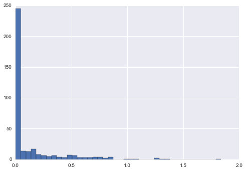

## 9.8 比较，掩码和布尔逻辑

> 本节是[《Python 数据科学手册》](https://github.com/jakevdp/PythonDataScienceHandbook)（Python Data Science Handbook）的摘录。
> 
> 译者：[飞龙](https://github.com/wizardforcel)
> 
> 协议：[CC BY-NC-SA 4.0](http://creativecommons.org/licenses/by-nc-sa/4.0/)

本节介绍如何使用布尔掩码，来检查和操作 NumPy 数组中的值。当你想要根据某些标准，提取，修改，计算或以其他方式操纵数组中的值时，掩码会有所帮助：例如，你可能希望计算大于某个值的所有值，或者可能删除高于某些阈值的所有异常值。

在 NumPy 中，布尔掩码通常是完成这些类型任务的最有效方法。

### 示例：统计雨天

想象一下，你有一系列数据表示某一城市一年中每天的降水量。例如，在这里我们将使用 Pandas 加载 2014 年西雅图市的每日降雨量统计数据（在第三章中有更详细的介绍）：

```py
import numpy as np
import pandas as pd

# 使用 pandas 将降雨量英寸提取为 NumPy 数组
rainfall = pd.read_csv('data/Seattle2014.csv')['PRCP'].values
inches = rainfall / 254  # 1/10mm -> 英寸
inches.shape

# (365,)
```

该数组包含 365 个值，提供了 2014 年 1 月 1 日至 12 月 31 日的每日降雨量，单位为英寸。

作为第一个简单的可视化，让我们看一下使用 Matplotlib 生成的雨天的直方图（我们将在第四章中更全面地探索这个工具）：

```py
%matplotlib inline
import matplotlib.pyplot as plt
import seaborn; seaborn.set()  # 设置绘图风格

plt.hist(inches, 40);
```




这个直方图让我们对数据的概况有了一个大概的了解：尽管它的声誉很高，但 2014 年西雅图的绝大多数日子的测得的降雨量几乎为零。但这并没有很好地传达我们希望看到的一些信息：例如，一年中有多少雨天？那些下雨天的平均降雨量是多少？ 有多少天有超过半英寸的降雨？

#### 挖掘数据

一种方法是手动回答这些问题：遍历数据，每当我们看到某个所需范围内的值时，递增计数器。由于本章讨论的原因，从编写代码的时间和计算结果的时间的角度来看，这种方法效率非常低。

我们在“NumPy 上的数组计算：通用函数”中看到，NumPy 的`ufuncs`可用于代替循环，对数组进行快速的逐元素算术运算；以同样的方式，我们可以使用其他`ufunc`对数组进行逐元素比较，然后我们可以操纵结果来回答我们的问题。

我们现在暂时搁置数据，并讨论 NumPy 中的一些常用工具，使用掩码快速回答这类的问题。

### 作为`ufunc`的比较运算

在“NumPy 上的数组计算：通用函数”中，我们介绍了`ufunc`，专注于算术运算符。 我们看到，在数组上使用``+``，``-``，``*``，``/``和其他，产生了逐元素操作。

NumPy 还将比较运算符，例如``<``（小于）和``>``（大于），实现为逐元素的`ufunc`。这些比较运算符的结果始终是布尔数据类型的数组。所有六种标准比较操作都可用：

```py
x = np.array([1, 2, 3, 4, 5])

x < 3  # 小于

# array([ True,  True, False, False, False], dtype=bool)

x > 3  # 大于

# array([False, False, False,  True,  True], dtype=bool)

x <= 3  # 小于等于

# array([ True,  True,  True, False, False], dtype=bool)

x >= 3  # 大于等于

# array([False, False,  True,  True,  True], dtype=bool)

x != 3  # 不等于

# array([ True,  True, False,  True,  True], dtype=bool)

x == 3  # 等于

# array([False, False,  True, False, False], dtype=bool)
```

也可以对两个数组进行逐元素比较，并包含复合表达式：

```py
(2 * x) == (x ** 2)

# array([False,  True, False, False, False], dtype=bool)
```

与算术运算符的情况一样，比较运算符在 NumPy 中实现为`ufunc`；例如，当你编写``x <3``时，NumPy 内部使用``np.less(x, 3)``。

此处显示了比较运算符及其等价`ufunc`的摘要：

| 运算符 | 等价 ufunc | 运算符 | 等价 ufunc |
| --- | --- | --- | --- |
| ``==`` | ``np.equal`` | ``!=`` | ``np.not_equal`` |
| ``<`` | ``np.less`` | ``<=`` | ``np.less_equal`` |
| ``>`` | ``np.greater`` | ``>=`` | ``np.greater_equal`` |

就像算术`ufunc`的情况一样，这些适用于任何大小和形状的数组。这是一个二维的例子：

```py
rng = np.random.RandomState(0)
x = rng.randint(10, size=(3, 4))
x

'''
array([[5, 0, 3, 3],
       [7, 9, 3, 5],
       [2, 4, 7, 6]])
'''

x < 6
'''
array([[ True,  True,  True,  True],
       [False, False,  True,  True],
       [ True,  True, False, False]], dtype=bool)
'''
```

在每种情况下，结果都是一个布尔数组，NumPy 提供了许多简单的模式来处理这些布尔结果。

### 使用布尔数组

给定一个布尔数组，你可以执行许多有用的操作。我们将使用``x``，我们之前创建的二维数组。

```py
print(x)

'''
[[5 0 3 3]
 [7 9 3 5]
 [2 4 7 6]]
'''
```

#### 对元素计数

要计算布尔数组中`True`元素的数量，``np.count_nonzero``很有用：

```py
# 多少个值小于 6
np.count_nonzero(x < 6)

# 8
```

我们看到有八个小于 6 的数组元素。获取此信息的另一种方法是使用``np.sum``；在这种情况下，``False``解释为``0``，而``True``解释为``1``：

```py
np.sum(x < 6)

# 8
```

`sum()``的好处就是和其他NumPy聚合函数一样，这个求和也可以沿着行或列来完成：

```py
# 每一行有多少个值小于 6
np.sum(x < 6, axis=1)

# array([4, 2, 2])
```

这计算了矩阵每行中小于 6 的值的数量。

如果我们有兴趣快速检查，是否任何或所有值都是真的，我们可以使用（你猜对了）``np.any``或``np.all``：

```py
# 存在大于 8 的值吗？
np.any(x > 8)

# True

# 存在小于 0 的值吗？
np.any(x < 0)

# False

# 所有值都小于 10 吗？
np.all(x < 10)

# True

# 所有值都等于 6 吗？
np.all(x == 6)

# False
```

``np.all``和``np.any``也可用于特定的轴。例如：

```py
# 每一行的所有值都小于 4 吗？
np.all(x < 8, axis=1)

# array([ True, False,  True], dtype=bool)
```

这里第一行和第三行中的所有元素都小于 8，而第二行则不是这种情况。

最后，一个简单的警告：如“聚合：最小、最大和之间的任何东西”中所述，Python 内置了``sum()``，`` any()``和``all()``函数。 它们的语法与 NumPy 版本不同，特别是在多维数组上使用时会失败或产生意外结果。对于这些情况，请确保使用``np.sum()``，``np.any()``和``np.all（()``！

#### 布尔运算符

我们已经看到了我们如何计算，比如降雨量小于 4 英寸的所有日子，或降雨量大于 2 英寸的所有日子。但是如果我们想了解降雨量小于 4 英寸且大于 1 英寸的所有日子呢？

这是通过 Python 的按位逻辑运算符，``&``，``|``，``^``和``~``来实现的。与标准算术运算符一样，NumPy 将这些重载为`ufunc`，这些`ufunc`在（通常是布尔）数组上逐元素工作。例如，我们可以像这样解决这种复合问题：


```py
np.sum((inches > 0.5) & (inches < 1))

# 29
```

所以我们看到有 29 天的降雨量在 0.5 到 1.0 英寸之间。请注意，此处的括号很重要 - 由于运算符优先级规则，删除了括号，此表达式将按如下方式计算，这会导致错误：

```py
inches > (0.5 & inches) < 1
```

使用`A AND B`和`NOT (NOT A OR NOT B)`的等价性（如果你已经参加了逻辑入门课程，你可能还记得），我们可以用不同的方式计算相同的结果：

```py
np.sum(~( (inches <= 0.5) | (inches >= 1) ))

# 29
```

在数组上组合比较运算符和布尔运算符。可以实现广泛的高效逻辑运算。下表总结了按位布尔运算符及其等效的`ufunc`：

| 运算符 | 等价 ufunc | 运算符 | 等价 ufunc |
| --- | --- | --- | --- |
| ``&`` | ``np.bitwise_and`` | <code>&#124;</code> | ``np.bitwise_or`` |
| ``^`` | ``np.bitwise_xor`` | ``~`` | ``np.bitwise_not`` |

使用这些工具，我们可以开始回答有关天气数据的问题。以下是将掩码聚合结合使用时，可以计算的一些结果示例：

```py
print("Number days without rain:      ", np.sum(inches == 0))
print("Number days with rain:         ", np.sum(inches != 0))
print("Days with more than 0.5 inches:", np.sum(inches > 0.5))
print("Rainy days with < 0.2 inches  :", np.sum((inches > 0) &
                                                (inches < 0.2)))
                                                
'''
Number days without rain:       215
Number days with rain:          150
Days with more than 0.5 inches: 37
Rainy days with < 0.2 inches  : 75
'''
```

### 作为掩码的布尔数组

在上一节中，我们研究了直接在布尔数组上计算的聚合。更强大的模式是将布尔数组用作掩码，来选择数据本身的特定子集。回到之前的``x``数组，假设我们想要所有值小于 5 的数组：

```py
x

'''
array([[5, 0, 3, 3],
       [7, 9, 3, 5],
       [2, 4, 7, 6]])
'''
```

我们可以很容易地获得这样的布尔数组，正如我们已经看到的：

```py
x < 5

'''
array([[False,  True,  True,  True],
       [False, False,  True, False],
       [ True,  True, False, False]], dtype=bool)
'''
```

现在为了从数组中选择这些值，我们可以简单地用这个布尔数组来索引；这被称为掩码操作：

```py
x[x < 5]

# array([0, 3, 3, 3, 2, 4])
```

返回的是一维数组，包含满足此条件的所有值；换句话说，掩码数组为`True`的位置的所有值。然后我们可以按照我们的意愿，自由操作这些值。例如，我们可以计算西雅图降雨量数据的一些相关统计数据：

```py
# 为所有雨天构造掩码
rainy = (inches > 0)

# 为所有夏天构造掩码（6 月 21 日是第 172 天）
days = np.arange(365)
summer = (days > 172) & (days < 262)

print("Median precip on rainy days in 2014 (inches):   ",
      np.median(inches[rainy]))
print("Median precip on summer days in 2014 (inches):  ",
      np.median(inches[summer]))
print("Maximum precip on summer days in 2014 (inches): ",
      np.max(inches[summer]))
print("Median precip on non-summer rainy days (inches):",
      np.median(inches[rainy & ~summer]))
      
'''
Median precip on rainy days in 2014 (inches):    0.194881889764
Median precip on summer days in 2014 (inches):   0.0
Maximum precip on summer days in 2014 (inches):  0.850393700787
Median precip on non-summer rainy days (inches): 0.200787401575
'''
```

通过组合布尔运算，掩码操作和聚合，我们可以非常快速地为我们的数据集回答这些问题。

### 注：使用关键字`and/or`与运算符`&/|`

一个常见的混淆点是，关键字`and`和`or`，与运算符``&``和``|``之间的区别。你什么时候使用其中一个？

区别在于：`and`和`or`衡量整个对象的真实性或错误性，而``&``和``|``指的是每个对象中的位。当你使用`and`和`or`时，它等同于要求 Python 将对象视为一个布尔实体。在 Python 中，所有非零整数都将计算为`True`。 从而：

```py
bool(42), bool(0)

# (True, False)

bool(42 and 0)

# False

bool(42 or 0)

# True
```

当你在整数上使用``&``和``|``时，表达式操作元素的位，将“和”或“或”应用于构成数字的各个位：

```py
bin(42)

# '0b101010'

bin(59)

# '0b111011'

bin(42 & 59)

# '0b101010'

bin(42 | 59)

# '0b111011'
```

请注意，比较二进制表示的相应位来产生结果。

当你在 NumPy 中有一个布尔值数组时，它可以看做是一串位，其中``1 = True``和``0 = False``，以及``&``和`|`操作的结果与上面类似：

```py
A = np.array([1, 0, 1, 0, 1, 0], dtype=bool)
B = np.array([1, 1, 1, 0, 1, 1], dtype=bool)
A | B

# array([ True,  True,  True, False,  True,  True], dtype=bool)
```

在这些数组上使用`and`或`or`，将尝试求解整个数组对象的真实性或错误性，这不是一个明确定义的值：

```py
A or B

'''
---------------------------------------------------------------------------

ValueError                                Traceback (most recent call last)

<ipython-input-38-5d8e4f2e21c0> in <module>()
----> 1 A or B


ValueError: The truth value of an array with more than one element is ambiguous. Use a.any() or a.all()
'''
```

类似地，当在给定数组上执行布尔表达式时，你应该使用``|``或``&``而不是``or``或``and``：

```py
x = np.arange(10)
(x > 4) & (x < 8)

# array([False, False, False, False, False,  True,  True,  True, False, False], dtype=bool)
```

试图求解整个数组的真实性或错误性，将给出我们之前看到的相同的`ValueError`：

```py
(x > 4) and (x < 8)

'''
---------------------------------------------------------------------------

ValueError                                Traceback (most recent call last)

<ipython-input-40-3d24f1ffd63d> in <module>()
----> 1 (x > 4) and (x < 8)


ValueError: The truth value of an array with more than one element is ambiguous. Use a.any() or a.all()
'''
```

所以记住这一点：``and``和``or``对整个对象执行单个布尔求值，而``&``和``|``对对象的内容（单个位或字节）执行多次布尔求值。对于布尔 NumPy 数组，后者几乎总是所需的操作。