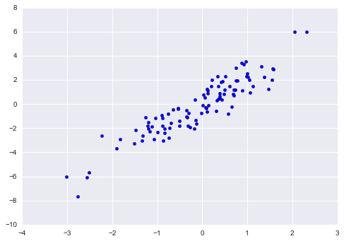
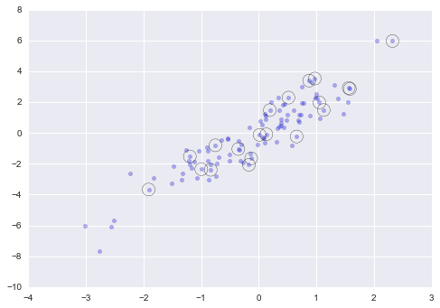

## 9.9 花式索引

> 本节是[《Python 数据科学手册》](https://github.com/jakevdp/PythonDataScienceHandbook)（Python Data Science Handbook）的摘录。
> 
> 译者：[飞龙](https://github.com/wizardforcel)
> 
> 协议：[CC BY-NC-SA 4.0](http://creativecommons.org/licenses/by-nc-sa/4.0/)

在前面的章节中，我们看到了如何使用简单的索引（例如，``arr [0]``），切片（例如，``arr [：5]``）和布尔掩码来访问和修改数组的片段（ 例如，``arr [arr> 0]``）。在本节中，我们将介绍另一种数组索引方式，称为花式索引。

花式索引就像我们已经看到的简单索引，但是我们传递索引数组来代替单个标量。这使我们能够非常快速地访问和修改数组的复杂子集。

### 探索花式索引

花式索引在概念上很简单：它意味着传递索引数组来同时访问多个数组元素。例如，请考虑以下数组：

```py
import numpy as np
rand = np.random.RandomState(42)

x = rand.randint(100, size=10)
print(x)

# [51 92 14 71 60 20 82 86 74 74]
```

假设我们想要访问三个不同的元素。 我们可以这样做：

```py
[x[3], x[7], x[2]]

# [71, 86, 14]
```

或者，我们可以传递单个列表或索引数组来获得相同的结果：

```py
ind = [3, 7, 4]
x[ind]

# array([71, 86, 60])
```

使用花式索引时，结果的形状反映索引数组的形状，而不是被索引的数组的形状：

```py
ind = np.array([[3, 7],
                [4, 5]])
x[ind]

'''
array([[71, 86],
       [60, 20]])
'''
```

花式索引也可以用在多个维度上。 考虑以下数组：

```py
X = np.arange(12).reshape((3, 4))
X

'''
array([[ 0,  1,  2,  3],
       [ 4,  5,  6,  7],
       [ 8,  9, 10, 11]])
'''
```

与标准索引一样，第一个索引指代行，第二个索引指代列：

```py
row = np.array([0, 1, 2])
col = np.array([2, 1, 3])
X[row, col]

# array([ 2,  5, 11])
```

注意结果中的第一个值是``X[0,2]``，第二个是``X[1,1]``，第三个是``X[2,3]``。

花式索引中的索引对遵循“数组计算：广播”中提到的所有广播规则。因此，例如，如果我们在索引中组合列向量和行向量，我们得到一个二维结果：

```py
X[row[:, np.newaxis], col]

'''
array([[ 2,  1,  3],
       [ 6,  5,  7],
       [10,  9, 11]])
'''
```

这里，每个行值匹配每个列向量，正如我们在算术运算的广播中看到的那样。例如：

```py
row[:, np.newaxis] * col

'''
array([[0, 0, 0],
       [2, 1, 3],
       [4, 2, 6]])
'''
```

重要的是要记住，通过花式索引，返回值反映了索引的广播形状，而不是被索引的数组的形状。

### 复合索引

对于更强大的操作，花式索引可以与我们看到的其他索引方案结合起来：

```py
print(X)

'''
[[ 0  1  2  3]
 [ 4  5  6  7]
 [ 8  9 10 11]]
'''
```

我们可以组合花式索引和简单索引：

```py
X[2, [2, 0, 1]]

# array([10,  8,  9])
```

我们可以组合花式索引和切片：

```py
X[1:, [2, 0, 1]]

'''
array([[ 6,  4,  5],
       [10,  8,  9]])
'''
```

我们可以组合花式索引和掩码：

```py
mask = np.array([1, 0, 1, 0], dtype=bool)
X[row[:, np.newaxis], mask]

'''
array([[ 0,  2],
       [ 4,  6],
       [ 8, 10]])
'''
```

所有这些索引选项的组合，产生一组非常灵活的操作，用于访问和修改数组值。

### 示例：选择随机点

花式索引的一个常见用途是从矩阵中选择行的子集。

例如，我们可能有`NxD`矩阵表示`D`维中的`N`非点，例如从二维正态分布中获取的以下几个点：

```py
mean = [0, 0]
cov = [[1, 2],
       [2, 5]]
X = rand.multivariate_normal(mean, cov, 100)
X.shape

# (100, 2)
```

使用我们在“Matplotlib 简介”中讨论的绘图工具，我们可以将这些点可视化为散点图：

```py
%matplotlib inline
import matplotlib.pyplot as plt
import seaborn; seaborn.set()  # 设置绘图风格

plt.scatter(X[:, 0], X[:, 1]);
```




让我们使用花式索引来选择 2 0个随机点。 我们首先选择 20 个没有重复的随机索引，然后使用这些索引选择原始数组的一部分：

```py
indices = np.random.choice(X.shape[0], 20, replace=False)
indices

'''
array([93, 45, 73, 81, 50, 10, 98, 94,  4, 64, 65, 89, 47, 84, 82, 80, 25,
       90, 63, 20])
'''

selection = X[indices]  # 花式索引
selection.shape

# (20, 2)
```

现在，要查看选择了哪些点，让我们在所选点的位置上绘制大圆圈：

```py
plt.scatter(X[:, 0], X[:, 1], alpha=0.3)
plt.scatter(selection[:, 0], selection[:, 1],
            facecolor='none', s=200);
```




这种策略通常用于数据集的快速分区，在训练/测试拆分中经常用于统计模型的验证（参见“超参数和模型验证”），以及在采样方法中用于回答统计问题。

### 使用花式索引修改值

正如可以使用花式索引来访问数组的某些片段，它也可以用于修改数组的某些部分。例如，假设我们有一个索引数组，我们想将数组中的相应项设置为某个值：

```py
x = np.arange(10)
i = np.array([2, 1, 8, 4])
x[i] = 99
print(x)

# [ 0 99 99  3 99  5  6  7 99  9]
```

我们可以使用任何赋值运算符。 例如：

```py
x[i] -= 10
print(x)

# [ 0 89 89  3 89  5  6  7 89  9]
```

但请注意，使用这些操作来重复索引，可能会导致一些潜在的意外结果。 考虑以下：

```py
x = np.zeros(10)
x[[0, 0]] = [4, 6]
print(x)

# [ 6.  0.  0.  0.  0.  0.  0.  0.  0.  0.]
```

4去了哪里？ 这个操作的结果是首先赋值``x[0] = 4``，然后是``x[0] = 6``。
结果当然是``x[0]``包含值 6。很合理，但考虑这个操作：

```py
i = [2, 3, 3, 4, 4, 4]
x[i] += 1
x

# array([ 6.,  0.,  1.,  1.,  1.,  0.,  0.,  0.,  0.,  0.])
```

你可能希望``x[3]``包含值 2，而``x[3]``将包含值 3，因为这是每个索引重复的次数。 为什么不是这样？从概念上讲，这是因为``x[i] += 1``是``x[i] = x[i] + 1``的简写。 求解``x[i] + 1``，然后将结果赋给`x`中的索引。考虑到这一点，它不是多次递增，而是赋值，这产生了相当不直观的结果。那么如果你想要重复操作的其他行为呢？ 为此，你可以使用`ufunc`的``at()```方法（自 NumPy 1.8 起可用），并执行以下操作：

```py
x = np.zeros(10)
np.add.at(x, i, 1)
print(x)

# [ 0.  0.  1.  2.  3.  0.  0.  0.  0.  0.]
```

``at()``方法使用指定的值（此处为 1）在指定的索引处（此处为`i`），执行给定运算符的原地应用。另一种本质上类似的方法是`ufunc`的``reduceat()``方法，你可以阅读 NumPy 文档。

### 示例：数据分箱

你可以使用这些想法有效地分割数据来手动创建直方图。例如，假设我们有 1,000 个值，并希望快速找到它们落入箱中的位置。我们可以使用``ufunc.at``计算它，如下所示：

```py
np.random.seed(42)
x = np.random.randn(100)

# 手动计算直方图
bins = np.linspace(-5, 5, 20)
counts = np.zeros_like(bins)

# 为每个 x 寻找合适的桶
i = np.searchsorted(bins, x)

# 给每个这些桶加 1
np.add.at(counts, i, 1)
```

计数现在反映每个箱中的点数 - 换句话说，直方图：

```py
# 绘制结果
plt.plot(bins, counts, linestyle='steps');
```


当然，每次想要绘制直方图时都必须这样做是很愚蠢的。
这就是 Matplotlib 提供``plt.hist()``例程的原因，它在一行中做了相同事情：

```py
plt.hist(x, bins, histtype='step');
```

函数将创建与此处看到的几乎相同的图。为了计算分箱，``matplotlib``使用``np.histogram``函数，它与我们之前做的计算非常相似。 我们在这里比较二者：

```py
print("NumPy routine:")
%timeit counts, edges = np.histogram(x, bins)

print("Custom routine:")
%timeit np.add.at(counts, np.searchsorted(bins, x), 1)

'''
NumPy routine:
10000 loops, best of 3: 97.6 μs per loop
Custom routine:
10000 loops, best of 3: 19.5 μs per loop
'''
```

我们自己的单行算法比 NumPy 中的优化算法快几倍！ 怎么会这样？如果你深入研究``np.histogram``源代码（你可以通过输入``np.histogram ??``来在 IPython 中这样做），你会发现它比我们所做的简单的搜索更加复杂；这是因为 NumPy 的算法更灵活，特别是在数据点数量变大时，为更好的性能而设计：

```py
x = np.random.randn(1000000)
print("NumPy routine:")
%timeit counts, edges = np.histogram(x, bins)

print("Custom routine:")
%timeit np.add.at(counts, np.searchsorted(bins, x), 1)

'''
NumPy routine:
10 loops, best of 3: 68.7 ms per loop
Custom routine:
10 loops, best of 3: 135 ms per loop
'''
```

这个比较表明，算法效率几乎从来都不是一个简单的问题。 对大型数据集有效的算法，并不总是小数据集的最佳选择，反之亦然（参见“大 O 记号”）。但是自己编码这个算法的好处是，通过理解这些基本方法，你可以使用这些积木来扩展它，来做一些非常有趣的自定义行为。

在数据密集型应用中有效使用 Python 的关键是，了解一般的便利例程，如``np.histogram``以及它们何时适用，但也知道如何在需要更精准的行为时使用更低级别的功能。